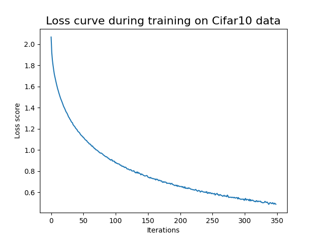
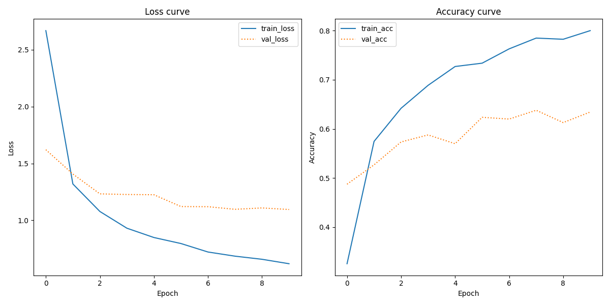
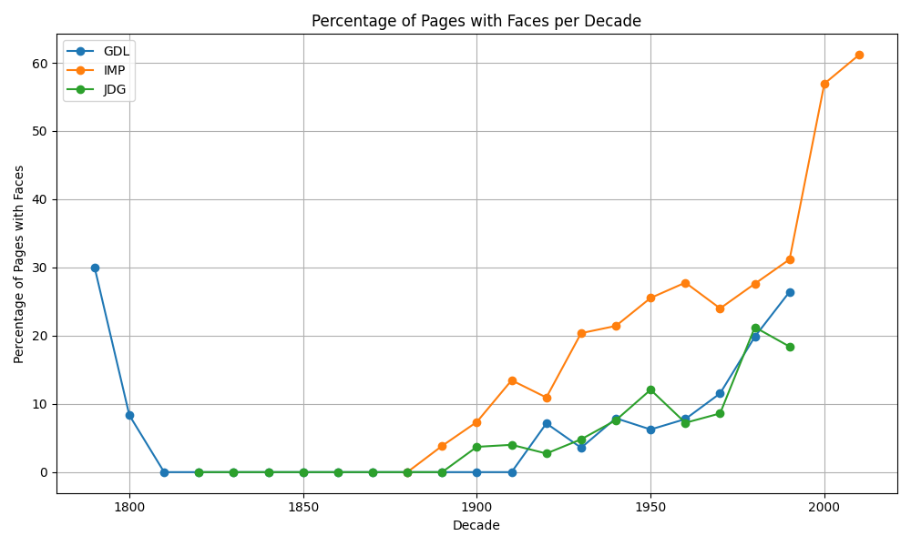

# Visual Analytics Portfolio (Assignments 1-4)
**Course**: Visual Analytics

**Author**: Sabrina Zaki Hansen
 
**Github-link**: https://github.com/sabszh/cds_vis/


# Table of Contents

- [Assignment 1: Building a Simple Image Search Algorithm](#assignment-1-building-a-simple-image-search-algorithm)
  - [Data Source](#data-source)
  - [Requirements](#requirements)
  - [Usage](#usage)
  - [Script Overview](#script-overview)
    - [Histogram-based Image Search](#histogram-based-image-search)
    - [VGG16 with KNN Image Search](#vgg16-with-knn-image-search)
  - [Output Summary](#output-summary)
  - [Discussion of Limitations and Possible Steps to Improvement](#discussion-of-limitations-and-possible-steps-to-improvement)
  - [File Structure](#file-structure)

- [Assignment 2: Classification Benchmarks with Logistic Regression and Neural Networks](#assignment-2-classification-benchmarks-with-logistic-regression-and-neural-networks)
  - [Data Source](#data-source-1)
  - [Requirements](#requirements-1)
  - [Usage](#usage-1)
  - [Script Overview](#script-overview-1)
  - [Output Summary](#output-summary-1)
  - [Discussion of Limitations and Possible Steps to Improvement](#discussion-of-limitations-and-possible-steps-to-improvement-1)
  - [File Structure](#file-structure-1)

- [Assignment 3: Document Classification Using Pretrained Image Embeddings](#assignment-3-document-classification-using-pretrained-image-embeddings)
  - [Data Source](#data-source-2)
  - [Requirements](#requirements-2)
  - [Usage](#usage-2)
  - [Script Overview](#script-overview-2)
  - [Output Summary](#output-summary-2)
  - [Discussion of Limitations and Possible Steps to Improvement](#discussion-of-limitations-and-possible-steps-to-improvement-2)
  - [File Structure](#file-structure-2)

- [Assignment 4: Detecting Faces in Historical Newspapers](#assignment-4-detecting-faces-in-historical-newspapers)
  - [Data Source](#data-source-3)
  - [Requirements](#requirements-3)
  - [Usage](#usage-3)
  - [Script Overview](#script-overview-3)
  - [Output Summary](#output-summary-3)
  - [Discussion of Limitations and Possible Steps to Improvement](#discussion-of-limitations-and-possible-steps-to-improvement-3)
  - [File Structure](#file-structure-3)

---


## Assignment 1: Building a Simple Image Search Algorithm
This script is designed to perform a simple image search algorithm based on color histograms or feature extraction using VGG16 with K-Nearest Neighbors (KNN) on images of flowers. It compares the features or color histograms of a target image to those of other images in the flower dataset and identifies the most similar images.

### Data source
The dataset used for this asssignment can be found [here](https://www.robots.ox.ac.uk/~vgg/data/flowers/17/). The data is a collection of over 1000 images of flowers, sampled from 17 different species. The dataset comes from the Visual Geometry Group at the University of Oxford.

### Requirements
- Python > 3.10.12
- `cv2` library
- `numpy` library
- `pandas` library
- `tensorflow` library
- `tqdm` library

### Usage
To use this script, follow these steps:

1. Clone or download the repository and make sure you have the file structure as pointed out, and the needed files stored in `in`

2. Set up a virtual environment and install the required packages by running:
    ```
    bash setup.sh
    ```

3. Run the script by executing:
    ```
    bash run.sh <target_image> <--method>
    ```
    - `<target_image>`: Path to image to compare with, example: in/flowers/image_1234.jpg
    - `<--method>`: Method for image search, either '--method histogram' for histogram or '--method vgg' for VGG using K-nearest-neighbor search.
    - Example of execution: `bash run.sh in/flowers/image_1234.jpg --method vgg` 

### Script overview
This Python script is designed for conducting an image seach. It has two methods at use, either using a search based on histograms for colors represented in the image or a neural network approach. 

*Below is an overview of the functions provided in the script:*

#### Histogram-based Image Search
- `extract_color_hist(image_path)`: Extracts color histograms for a single image.
- `compare_histograms(target_histogram, histograms_list)`: Compares the histogram of a target image to other histograms using Chi-Squared distance.

#### VGG16 with KNN Image Search
- `extract_features(img_path, model)`: Extracts features from image data using the VGG16 model.
- `find_similar_images_vgg(target_image_path, dataset_dir, num_neighbors=5)`: Finds similar images to the target image using VGG16 features and KNN.

### Output Summary
The script saves the results to a CSV file in the output folder. The CSV file contains the filenames of the top similar images that are most similar to the target image along with their respective distances.

#### Table 1: Example of Histogram Output

| Filename       | Distance |
|----------------|----------|
| image_1234.jpg | 0.0      |
| image_1125.jpg | 10.5     |
| image_0575.jpg | 11.24    |
| image_0727.jpg | 12.18    |
| image_1124.jpg | 12.25    |
| image_0174.jpg | 13.08    |

#### Table 2: Example of VGG16 Output
| Filename       | Distance |
|----------------|----------|
| image_1234.jpg | 0.0      |
| image_1215.jpg | 0.09     |
| image_1207.jpg | 0.11     |
| image_1233.jpg | 0.11     |
| image_1211.jpg | 0.11     |
| image_1212.jpg | 0.12     |

The table lists the distance measurements for a set of image files. The "Filename" column indicates the name of each image file, and the "Distance" column displays the corresponding distance measurement (Chi-Squared distance for histogram, and KNN for VGG16)

### Discussion of Limitations and Possible Steps to Improvement
One potential limitation of this approach is the absence of a robust benchmarking method for evaluating image searches beyond visual inspection. Currently, the assessment was done by manually comparing retrieved images with the target image based on visual similarity. One strategy to address this limitation could involve comparing the performance of the implemented methods against established and reliable image search algorithms.

Alternatively, utilizing a pre-labeled dataset for evaluation could provide a more structured approach; however, this would still be constrained by the chosen similarity metric, which can vary depending on factors such as color composition, object categories, and image aspect ratios. Consequently, the effectiveness of both methods is heavily bound by their respective extraction techniques. For instance, the histogram-based method may encounter difficulties with images sharing similar color distributions but differing in content. Moreover, since it operates as a black-box model, we lack insights into the specific features it extracts and their potential generalizability across different datasets.

From a computational standpoint, both methods utilized in this search approach demand significant resources, particularly when considering potential scalability issues as the dataset could expand. The current implementation may encounter challenges, especially in terms of memory usage for feature extraction, particularly with constrained computational capabilities. With each script execution, the process involves extracting histograms/features and then identifying target images. To alleviate the time and energy consumption associated with this process, one strategy could involve embedding the images and subsequently querying against nearby vectors.

### File Structure
The project directory should be structured as follows:

```
.
A1/
│
├── in/
│   └── flowers/
│       ├── image_0001.jpg
│       ├── image_0002.jpg
│       └── ...
├── out/
│   ├── results_vgg.csv
│   └── results_histogram.csv
├── src/
│   └── image_search.py
│
├── README.md
├── requirements.txt
├── run.sh
└── setup.sh
```

## Assignment 2: Classification benchmarks with Logistic Regression and Neural Networks
This project provides a framework for comparing classification performance using Logistic Regression and Neural Networks on the CIFAR-10 dataset. The aim of this project is to demonstrate the effectiveness of Logistic Regression and Neural Networks in classifying images from the CIFAR-10 dataset. It includes functionalities for data preprocessing, model training, evaluation, and result visualization.

### Data Source
The CIFAR-10 dataset consists of 60000 32x32 colour images in 10 classes, with 6000 images per class. There are 50000 training images and 10000 test images.

The dataset is divided into five training batches and one test batch, each with 10000 images. The test batch contains exactly 1000 randomly-selected images from each class. The training batches contain the remaining images in random order, but some training batches may contain more images from one class than another. Between them, the training batches contain exactly 5000 images from each class.

Find more details [here](https://www.cs.toronto.edu/~kriz/cifar.html).

### Requirements
- Python > 3.10.12
- `matplotlib` library
- `numpy` library
- `scikit_learn` library
- `tensorflow` library
- `opencv-python` library

### Usage
To use this script, follow these steps:

1. Clone or download the repository and make sure you have the file structure as pointed out, and the needed files stored in `in`

2. Set up a virtual environment and install the required packages by running:
    ```
    bash setup.sh
    ```

3. Run the script by executing:
    ```
    bash run.sh <--model>
    ```
    - `<--model>`: Model for classification, either 'logistic' for logistic regression or 'neural' for neural network benchmarking.
    - Example: `bash run.sh --model neural` 

### Script Overview

- `parse_arguments()`: Parses command-line arguments.
- `grayscaler(image_array)`: Converts color images to grayscale.
- `normalizer(grayed_image)`: Normalizes grayscale images.
- `flattener(grayed_image)`: Flattens grayscale images.
- `labeler(train, test)`: Renames numerical labels to corresponding class names.
- `preprocessor(train_images, test_images)`: Preprocesses input images.
- `logistic_regression_classifier(X_train, y_train, X_test, y_test)`: Trains and tests Logistic Regression classifier.
- `neural_network_classifier(X_train, y_train, X_test, y_test)`: Trains and tests Neural Network classifier.
- `save_report(report, report_name)`: Saves classification report to a text file.
- `loss_curve(classifier)`: Plots and saves loss curve during training of Neural Network classifier.
- `main()`: Main function orchestrating the entire process.

### Output Summary

The script when run with both methods, exports three files to the output folder: two text files containing the classification reports and a plot depicting the loss curve of the neural network classification. The texts files includes details of class names, precision, recall, F1-score, support, accuracy, as well as macro and weighted averages.

#### Table 1: Classification Report for Logistic Regression
| Class      | Precision | Recall | F1-Score | Support |
|------------|-----------|--------|----------|---------|
| airplane   | 0.34      | 0.39   | 0.36     | 1000    |
| automobile | 0.29      | 0.31   | 0.30     | 1000    |
| bird       | 0.21      | 0.16   | 0.18     | 1000    |
| cat        | 0.18      | 0.14   | 0.16     | 1000    |
| deer       | 0.21      | 0.16   | 0.18     | 1000    |
| dog        | 0.27      | 0.25   | 0.26     | 1000    |
| frog       | 0.21      | 0.19   | 0.20     | 1000    |
| horse      | 0.24      | 0.28   | 0.26     | 1000    |
| ship       | 0.33      | 0.35   | 0.34     | 1000    |
| truck      | 0.32      | 0.43   | 0.37     | 1000    |
|            |           |        |          |         |
| Accuracy   |           |        | 0.27     | 10000   |
| Macro Avg  | 0.26      | 0.27   | 0.26     | 10000   |
| Weighted Avg | 0.26    | 0.27   | 0.26     | 10000   |

#### Table 2: Classification Report for Neural Network 
| Class      | Precision | Recall | F1-Score | Support |
|------------|-----------|--------|----------|---------|
| airplane   | 0.34      | 0.33   | 0.34     | 1000    |
| automobile | 0.29      | 0.27   | 0.28     | 1000    |
| bird       | 0.22      | 0.23   | 0.22     | 1000    |
| cat        | 0.17      | 0.16   | 0.17     | 1000    |
| deer       | 0.20      | 0.19   | 0.20     | 1000    |
| dog        | 0.26      | 0.25   | 0.26     | 1000    |
| frog       | 0.27      | 0.26   | 0.26     | 1000    |
| horse      | 0.25      | 0.32   | 0.28     | 1000    |
| ship       | 0.38      | 0.36   | 0.37     | 1000    |
| truck      | 0.29      | 0.29   | 0.29     | 1000    |
|            |           |        |          |         |
| Accuracy   |           |        | 0.27     | 10000   |
| Macro Avg  | 0.27      | 0.27   | 0.27     | 10000   |
| Weighted Avg | 0.27    | 0.27   | 0.27     | 10000   |

The classification reports for logistic regression and neural network models on the CIFAR-10 dataset provide insights into the performance across different classes. Both models achieve an accuracy of 0.27, indicating that they correctly classify approximately 27% of the test images.

For logistic regression, precision, recall, and F1-score values range from 0.18 to 0.37 across different classes. For the neural network, similar values are observed, ranging from 0.17 to 0.38.

These metrics measure the models' ability to correctly classify instances of each class (precision), their ability to capture all relevant instances of each class (recall), and the balance between precision and recall (F1-score). Overall, the performance across classes is relatively consistent between the two models.

The macro average calculates the metrics independently for each class and then takes the unweighted mean of the scores. For both models, the macro average precision, recall, and F1-score are around 0.27.

Weighted average considers the support (the number of true instances for each label) when computing the average. Again, the values are consistent between the logistic regression and neural network models, with weighted average precision, recall, and F1-score around 0.27.

The models' performance is moderate, as indicated by the relatively low precision, recall, and F1-scores across classes. Both models struggle particularly with classes like bird, cat, and deer, where precision, recall, and F1-scores are lower compared to other classes.

Despite their limitations, the models achieve a balanced performance across classes, as evident from the consistent macro and weighted averages.

#### Figure 3: Loss Curve Plot (Neral Network classification)


The loss curve specifically shows a declining curve, indicating that the loss score descreases as the number of training iterations increases, meaning that the neural network is effectively learning and improving its performance as training progresses. The convergence of the loss curve towards a value close to 0.5 suggests that the model reaches a stable state where further iterations do not significantly reduce the loss score. 

### Discussion of Limitations and Possible Steps to Improvement
The provided code implements classification benchmarks using logistic regression and neural networks on the CIFAR-10 dataset for image recognition. While the code performs the intended tasks, there are several limitations and potential areas for improvement. The models achieve an overall accuracy of 0.27, indicating moderate performance. However, precision, recall, and F1-scores across classes range from 0.17 to 0.38, suggesting room for improvement.

Currently the models employ default hyperparamters, which could be the cause for not getting the best performance. Conduction hyperparameter tuning using techniques like grid search could help in optimizing the performance and improve the classification. Moreover, an area of improvment could be to increase the diversity of the training data by augumenting the data, such as rotating, flipping, and/or scaling. By doing this, it could potentially improve the models' generalization capability and performance on unseen data. Another suggestions for improvement in accuracy, would be to test out some more complex model archeitehcues, such as CNN, which could perhaps capture more patterns in the data and improve the classification accuracy. 

In conclusion, while the logistic regression and neural network models demonstrate moderate performance on the CIFAR-10 dataset, there is room for improvement, especially in handling specific classes more effectively. Further optimization through hyperparameter tuning, data augmentation, and model architecture adjustments could enhance their classification accuracy and robustness.

### File Structure
The project directory should be structured as follows:

```
.
A2/
│
├── out/
│   ├── logistic_report.txt
│   ├── loss_curve_nn.png
│   └── neural_report.txt
│
├── src/
│   └── classification.py
│
├── README.md
├── requirements.txt
├── run.sh
└── setup.sh
```

## Assignment 3: Document Classification using Pretrained Image Embeddings
The goal of this assignment is to classify documents based solely on their visual appearance, rather than usually the textual content. This is achieved by leveraging pretrained image embeddings and Convolutional Neural Networks (CNNs).

### Data source
The dataset used for this task is the Tobacco3482 dataset. The dataset consists of document images belonging to 10 classes such as letter, form, emial, resume, memo, etc. The dataset has 3482 images. You can find it [here](https://www.kaggle.com/datasets/patrickaudriaz/tobacco3482jpg?resource=download)

### Requirements
- Python > 3.10.12
- `matplotlib` library
- `numpy` library
- `scikit_learn` library
- `tensorflow` library

### Usage
To use this script, follow these steps:

1. Clone or download the repository and make sure you have the file structure as pointed out, and the needed files stored in `in`

2. Set up a virtual environment and install the required packages by running:
    ```
    bash setup.sh
    ```

3. Run the script by executing:
    ```
    bash run.sh
    ```

### Script Overview

1. **Loading Data**: The script loads images from the specified data path. Each image is associated with a label indicating its document type.

2. **Preprocessing Images**: Images are preprocessed to prepare them for input into the VGG16 model. Preprocessing includes resizing, converting to arrays, and applying preprocessing specific to the VGG16 model.

3. **Building Model**: A CNN model based on VGG16 architecture is constructed with additional classification layers. The model is compiled using Adam optimizer and categorical crossentropy loss.

4. **Training the Model**: The model is trained on the preprocessed image data. Training is performed for a fixed number of epochs with a validation split. Training history including loss and accuracy curves are plotted and saved.

5. **Evaluation**: The trained model is evaluated using the test data. A classification report is generated and saved to assess the performance of the model.

### Output Summary

**Table 1: Classification Report**
|              | precision | recall | f1-score | support |
|--------------|-----------|--------|----------|---------|
| ADVE         | 0.93      | 0.91   | 0.92     | 46      |
| Email        | 0.81      | 0.89   | 0.85     | 120     |
| Form         | 0.74      | 0.65   | 0.69     | 86      |
| Letter       | 0.73      | 0.59   | 0.65     | 114     |
| Memo         | 0.57      | 0.81   | 0.67     | 124     |
| News         | 0.83      | 0.92   | 0.88     | 38      |
| Note         | 0.76      | 0.55   | 0.64     | 40      |
| Report       | 0.52      | 0.57   | 0.54     | 53      |
| Resume       | 0.56      | 0.38   | 0.45     | 24      |
| Scientific   | 0.59      | 0.37   | 0.45     | 52      |
| accuracy     |           |        | 0.70     | 697     |
| macro avg    | 0.70      | 0.66   | 0.67     | 697     |
| weighted avg | 0.70      | 0.70   | 0.69     | 697     |

This classification report evaluates a model's performance in classifying various types of documents. It shows precision (accuracy of positive predictions), recall (coverage of actual positives), and F1-score (balance between precision and recall) for each class. Overall accuracy is 70%. Some classes like "ADVE," "Email," and "News" perform well, while others like "Report," "Resume," and "Scientific" need improvement.

##### Loss Curve and Accuracy Score


Learning curves illustrate the progression of training and validation loss alongside training and validation accuracy across epochs. They serve to reveal the model's convergence and identify potential overfitting or underfitting. The loss curve demonstrates a consistent decrease in both training and validation loss over epochs, indicating improved model performance. Similarly, the accuracy curve depicts a gradual increase with each epoch, signifying the model's learning process.

### Discussion of Limitations and Possible Steps to Improvement
In document classification using pretrained image embeddings, some limitations and areas for improvement are evident.

While the model performed well on the validation set, its effectiveness might vary with data from different sources due to differences in image quality and background noise. Since all documents come from one domain (Tobacco fabric), noise levels within each document type are likely similar. Hence, the model may not perform as well with documents from other sources. Another limitation is the model's reliance on predefined image features extracted by the VGG16 network. This may limit its ability to handle unseen classes or document layout variations. Additionally, the dataset size is relatively small, potentially leading to overfitting and hindering the model's capability to learn robust representations of document types. The model architecture, based on VGG16 with additional dense layers, might not capture intricate features in document images effectively. Experimenting with different architectures, like CNNs tailored for document analysis, could improve performance.

To address these limitations, augmenting the dataset with diverse document images can mitigate overfitting and improve generalization. Fine-tuning the pretrained VGG16 network or using other architectures pretrained on large-scale document datasets may yield better feature representations. Data preprocessing techniques, such as noise reduction and data balancing, can further enhance the model's robustness and generalization capability.

### File Structure
The project directory should be structured as follows:

```
.
A3/
│
├── in/
│   └── Tobacco3482/
│        ├── ADVE/
│        │   ├── <filename>.jpg
│        │   └── ...
│        ├── Email/
│        │   ├── <filename>.jpg
│        │   └── ...
│        └── ...
│
├── out/
│   ├── classification_Report.txt
│   └── training_curves.png
│
├── src/
│   └── doc_classification.py
│
├── README.md
├── requirements.txt
├── run.sh
└── setup.sh
```

## Assignment 4: Detecting faces in historical newspapers
The aim of this assignment is to explore the occurrence of *human facial images* in historical newspapers by employing FaceNet with Torch. This inquiry seeks to address the following research question: how has the frequency of human facial depictions evolved in printed media over the past approximately two centuries? Are there discernible disparities, and if so, what implications might they carry?

### Data Source
The assignment works with a corpus of historic Swiss newspapers: the *Journal de Genève* (JDG, 1826-1994); the *Gazette de Lausanne* (GDL, 1804-1991); and the Impartial (IMP, 1881-2017). You can read more about this corpus in the associated [research article](https://zenodo.org/records/3706863)

### Requirements
- Python > 3.10.12
- `gensim` library
- `numpy` library
- `pandas` library
- `codecarbon` library

### Usage
To use this script, follow these steps:

1. Clone or download the repository and make sure you have the file structure as pointed out, and the needed files stored in `in`

2. Set up a virtual environment and install the required packages by running:
    ```
    bash setup.sh
    ```

3. Run the script by executing:
    ```
    bash run.sh
    ```

### Script Overview
- **Face Detection**: The script uses a pretrained MTCNN (Multi-Task Cascaded Convolutional Networks) model for face detection in historical newspaper images.
- **Data Processing**: Images are processed to extract information about the number of faces present in each image and categorize them by decade.
- **Data Analysis**: The script calculates the percentage of pages with faces per decade for each newspaper and generates corresponding CSV files.
- **Visualization**: It also plots the percentage of pages with faces per decade for each newspaper and saves the plot as an image.

### Output Summary
The output of the script includes:

- CSV files containing the count of faces per file as well as an assigned decade
- A plot showing the percentage of pages with faces per decade for each newspaper.

##### Figure 1: Plot of the percentage of pages with faces per decade for each newspaper


### Discussion of Limitations and Possible Steps to Improvement
The accuracy of face detection for historical newspaper images heavily relies on the performance of the pretrained face detection model (MTCNN). Any inaccuracies or biases in the model can directly affect the results of the analysis.

Possible biases in the face detection model could include:
- Ethnicity bias: the model may have been trained primarily on datasets containing mainly white faces, leading to bias in terms of detecthing other ethnicities.
- Gender bias: it might be more accurate in detecting face for one gender than the other
- Age bias: similar to above, depending again on what has been included in the training data

Another possible limitation of this setup, might be that the might not be good at detecting faces if the image quality or lightning is poor, therefor potentially skewing the results.

Moreover, a limitations lies within the lack of validation, due to the large volume of historical newspaper images, manually verifying the accuracy of face detections in each image is impractical. Without this, there is no defeinite way to confirm whether the detected faces are correctly identified, potentially leading to false positives or negatives. 

However, it is assumed that the model should perform rather good as it has been benchmarked and used by other researchers.

The findings of an increased percentage of pages with faces over decaded is concluded by the rather significant increase (no significiance testing was however done, but mere eye balling on the plot). The reasons for this increase could be mainly due to technological advancements within print and photography. Moreover it might have also been due to a shift towards visual content in media. 

### File Structure
The project directory should be structured as follows:

```
.
A4/
│
├── in/
│   └── newspapers/
│        ├── GDL/
│        │   ├── <filename>.jpg
│        │   └── ...
│        ├── IMP/
│        │   ├── <filename>.jpg
│        │   └── ...
│        ├── JDG/
│        │   ├── <filename>.jpg
│        │   └── ...
│        └── README-images.txt
├── out/
│   ├── GDL_data.csv
│   ├── IMP_data.csv
│   ├── JDG_data.csv
│   └── newspaper_sample_face_counts.csv
├── src/
│   └── newspaper_face_detection.py
│
├── README.md
├── requirements.txt
├── run.sh
└── setup.sh
```