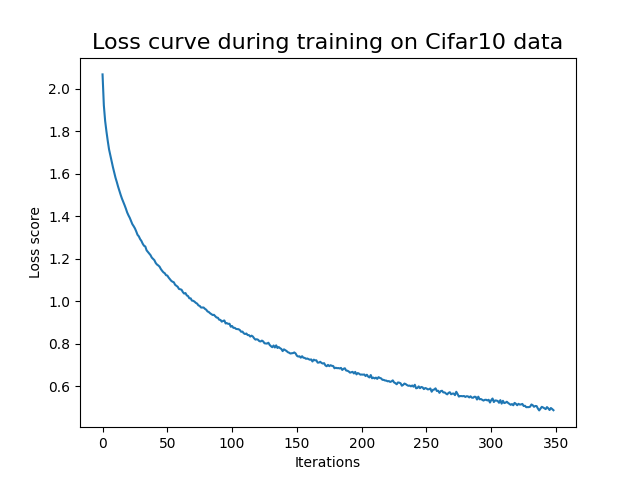

# Assignment 2 - Classification benchmarks with Logistic Regression and Neural Networks
This project provides a framework for comparing classification performance using Logistic Regression and Neural Networks on the CIFAR-10 dataset. The aim of this project is to demonstrate the effectiveness of Logistic Regression and Neural Networks in classifying images from the CIFAR-10 dataset. It includes functionalities for data preprocessing, model training, evaluation, and result visualization.

## Data Source
The CIFAR-10 dataset consists of 60000 32x32 colour images in 10 classes, with 6000 images per class. There are 50000 training images and 10000 test images.

The dataset is divided into five training batches and one test batch, each with 10000 images. The test batch contains exactly 1000 randomly-selected images from each class. The training batches contain the remaining images in random order, but some training batches may contain more images from one class than another. Between them, the training batches contain exactly 5000 images from each class.

Find more details [here](https://www.cs.toronto.edu/~kriz/cifar.html).

## Requirements
- Python > 3.10.12
- `matplotlib` library
- `numpy` library
- `scikit_learn` library
- `tensorflow` library
- `opencv-python` library

## Usage
To use this script, follow these steps:

1. Clone or download the repository and make sure you have the file structure as pointed out, and the needed files stored in `in`

2. Set up a virtual environment and install the required packages by running:
    ```
    bash setup.sh
    ```

3. Run the script by executing:
    ```
    bash run.sh <--model>
    ```
    - `<--model>`: Model for classification, either 'logistic' for logistic regression or 'neural' for neural network benchmarking.
    - Example: `bash run.sh --model neural` 

## Script Overview

- `parse_arguments()`: Parses command-line arguments.
- `grayscaler(image_array)`: Converts color images to grayscale.
- `normalizer(grayed_image)`: Normalizes grayscale images.
- `flattener(grayed_image)`: Flattens grayscale images.
- `labeler(train, test)`: Renames numerical labels to corresponding class names.
- `preprocessor(train_images, test_images)`: Preprocesses input images.
- `logistic_regression_classifier(X_train, y_train, X_test, y_test)`: Trains and tests Logistic Regression classifier.
- `neural_network_classifier(X_train, y_train, X_test, y_test)`: Trains and tests Neural Network classifier.
- `save_report(report, report_name)`: Saves classification report to a text file.
- `loss_curve(classifier)`: Plots and saves loss curve during training of Neural Network classifier.
- `main()`: Main function orchestrating the entire process.

## Output Summary

The script when run with both methods, exports three files to the output folder: two text files containing the classification reports and a plot depicting the loss curve of the neural network classification. The texts files includes details of class names, precision, recall, F1-score, support, accuracy, as well as macro and weighted averages.

### Table 1: Classification Report for Logistic Regression
| Class      | Precision | Recall | F1-Score | Support |
|------------|-----------|--------|----------|---------|
| airplane   | 0.34      | 0.39   | 0.36     | 1000    |
| automobile | 0.29      | 0.31   | 0.30     | 1000    |
| bird       | 0.21      | 0.16   | 0.18     | 1000    |
| cat        | 0.18      | 0.14   | 0.16     | 1000    |
| deer       | 0.21      | 0.16   | 0.18     | 1000    |
| dog        | 0.27      | 0.25   | 0.26     | 1000    |
| frog       | 0.21      | 0.19   | 0.20     | 1000    |
| horse      | 0.24      | 0.28   | 0.26     | 1000    |
| ship       | 0.33      | 0.35   | 0.34     | 1000    |
| truck      | 0.32      | 0.43   | 0.37     | 1000    |
|            |           |        |          |         |
| Accuracy   |           |        | 0.27     | 10000   |
| Macro Avg  | 0.26      | 0.27   | 0.26     | 10000   |
| Weighted Avg | 0.26    | 0.27   | 0.26     | 10000   |

### Table 2: Classification Report for Neural Network 
| Class      | Precision | Recall | F1-Score | Support |
|------------|-----------|--------|----------|---------|
| airplane   | 0.34      | 0.33   | 0.34     | 1000    |
| automobile | 0.29      | 0.27   | 0.28     | 1000    |
| bird       | 0.22      | 0.23   | 0.22     | 1000    |
| cat        | 0.17      | 0.16   | 0.17     | 1000    |
| deer       | 0.20      | 0.19   | 0.20     | 1000    |
| dog        | 0.26      | 0.25   | 0.26     | 1000    |
| frog       | 0.27      | 0.26   | 0.26     | 1000    |
| horse      | 0.25      | 0.32   | 0.28     | 1000    |
| ship       | 0.38      | 0.36   | 0.37     | 1000    |
| truck      | 0.29      | 0.29   | 0.29     | 1000    |
|            |           |        |          |         |
| Accuracy   |           |        | 0.27     | 10000   |
| Macro Avg  | 0.27      | 0.27   | 0.27     | 10000   |
| Weighted Avg | 0.27    | 0.27   | 0.27     | 10000   |

The classification reports for logistic regression and neural network models on the CIFAR-10 dataset provide insights into the performance across different classes. Both models achieve an accuracy of 0.27, indicating that they correctly classify approximately 27% of the test images.

For logistic regression, precision, recall, and F1-score values range from 0.18 to 0.37 across different classes. For the neural network, similar values are observed, ranging from 0.17 to 0.38.

These metrics measure the models' ability to correctly classify instances of each class (precision), their ability to capture all relevant instances of each class (recall), and the balance between precision and recall (F1-score). Overall, the performance across classes is relatively consistent between the two models.

The macro average calculates the metrics independently for each class and then takes the unweighted mean of the scores. For both models, the macro average precision, recall, and F1-score are around 0.27.

Weighted average considers the support (the number of true instances for each label) when computing the average. Again, the values are consistent between the logistic regression and neural network models, with weighted average precision, recall, and F1-score around 0.27.

The models' performance is moderate, as indicated by the relatively low precision, recall, and F1-scores across classes. Both models struggle particularly with classes like bird, cat, and deer, where precision, recall, and F1-scores are lower compared to other classes.

Despite their limitations, the models achieve a balanced performance across classes, as evident from the consistent macro and weighted averages.

### Figure 3: Loss Curve Plot (Neral Network classification)


The loss curve specifically shows a declining curve, indicating that the loss score descreases as the number of training iterations increases, meaning that the neural network is effectively learning and improving its performance as training progresses. The convergence of the loss curve towards a value close to 0.5 suggests that the model reaches a stable state where further iterations do not significantly reduce the loss score. 

## Discussion of Limitations and Possible Steps to Improvement
The provided code implements classification benchmarks using logistic regression and neural networks on the CIFAR-10 dataset for image recognition. While the code performs the intended tasks, there are several limitations and potential areas for improvement. The models achieve an overall accuracy of 0.27, indicating moderate performance. However, precision, recall, and F1-scores across classes range from 0.17 to 0.38, suggesting room for improvement.

Currently the models employ default hyperparamters, which could be the cause for not getting the best performance. Conduction hyperparameter tuning using techniques like grid search could help in optimizing the performance and improve the classification. Moreover, an area of improvment could be to increase the diversity of the training data by augumenting the data, such as rotating, flipping, and/or scaling. By doing this, it could potentially improve the models' generalization capability and performance on unseen data. Another suggestions for improvement in accuracy, would be to test out some more complex model archeitehcues, such as CNN, which could perhaps capture more patterns in the data and improve the classification accuracy. 

In conclusion, while the logistic regression and neural network models demonstrate moderate performance on the CIFAR-10 dataset, there is room for improvement, especially in handling specific classes more effectively. Further optimization through hyperparameter tuning, data augmentation, and model architecture adjustments could enhance their classification accuracy and robustness.

## File Structure
The project directory should be structured as follows:

```
.
A2/
│
├── out/
│   ├── logistic_report.txt
│   ├── loss_curve_nn.png
│   └── neural_report.txt
│
├── src/
│   └── classification.py
│
├── README.md
├── requirements.txt
├── run.sh
└── setup.sh
```