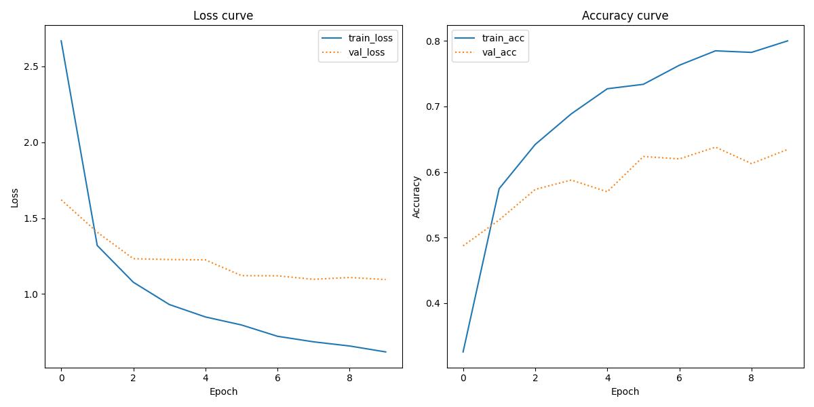

# Assignment 3 - Document Classification using Pretrained Image Embeddings

The goal of this assignment is to classify documents based solely on their visual appearance, rather than their textual content. This is achieved by leveraging pretrained image embeddings and Convolutional Neural Networks (CNNs).

## Data source
The dataset used for this task is the Tobacco3482 dataset. The dataset consists of document images belonging to 10 classes such as letter, form, emial, resume, memo, etc. The dataset has 3482 images. You can find it [here](https://www.kaggle.com/datasets/patrickaudriaz/tobacco3482jpg?resource=download)

## Usage
To use this script, follow these steps:

1. Clone or download the repository and make sure you have the file structure as pointed out, and the needed files stored in `in`

2. Set up a virtual environment and install the required packages by running:
    ```
    bash setup.sh
    ```

3. Run the script by executing:
    ```
    bash run.sh
    ```

## Script Overview

1. **Loading Data**: The script loads images from the specified data path. Each image is associated with a label indicating its document type.

2. **Preprocessing Images**: Images are preprocessed to prepare them for input into the VGG16 model. Preprocessing includes resizing, converting to arrays, and applying preprocessing specific to the VGG16 model.

3. **Building Model**: A CNN model based on VGG16 architecture is constructed with additional classification layers. The model is compiled using Adam optimizer and categorical crossentropy loss.

4. **Training the Model**: The model is trained on the preprocessed image data. Training is performed for a fixed number of epochs with a validation split. Training history including loss and accuracy curves are plotted and saved.

5. **Evaluation**: The trained model is evaluated using the test data. A classification report is generated and saved to assess the performance of the model.

## Output Summary

**Table 1: Classification Report**
|              | precision | recall | f1-score | support |
|--------------|-----------|--------|----------|---------|
| ADVE         | 0.93      | 0.91   | 0.92     | 46      |
| Email        | 0.81      | 0.89   | 0.85     | 120     |
| Form         | 0.74      | 0.65   | 0.69     | 86      |
| Letter       | 0.73      | 0.59   | 0.65     | 114     |
| Memo         | 0.57      | 0.81   | 0.67     | 124     |
| News         | 0.83      | 0.92   | 0.88     | 38      |
| Note         | 0.76      | 0.55   | 0.64     | 40      |
| Report       | 0.52      | 0.57   | 0.54     | 53      |
| Resume       | 0.56      | 0.38   | 0.45     | 24      |
| Scientific   | 0.59      | 0.37   | 0.45     | 52      |
| accuracy     |           |        | 0.70     | 697     |
| macro avg    | 0.70      | 0.66   | 0.67     | 697     |
| weighted avg | 0.70      | 0.70   | 0.69     | 697     |

This classification report evaluates a model's performance in classifying various types of documents. It shows precision (accuracy of positive predictions), recall (coverage of actual positives), and F1-score (balance between precision and recall) for each class. Overall accuracy is 70%. Some classes like "ADVE," "Email," and "News" perform well, while others like "Report," "Resume," and "Scientific" need improvement.

### Loss Curve and Accuracy Score


Learning curves illustrate the progression of training and validation loss alongside training and validation accuracy across epochs. They serve to reveal the model's convergence and identify potential overfitting or underfitting. The loss curve demonstrates a consistent decrease in both training and validation loss over epochs, indicating improved model performance. Similarly, the accuracy curve depicts a gradual increase with each epoch, signifying the model's learning process.

## Discussion of Limitations and Possible Steps to Improvement
In document classification using pretrained image embeddings, some limitations and areas for improvement are evident.

While the model performed well on the validation set, its effectiveness might vary with data from different sources due to differences in image quality and background noise. Since all documents come from one domain (Tobacco fabric), noise levels within each document type are likely similar. Hence, the model may not perform as well with documents from other sources. Another limitation is the model's reliance on predefined image features extracted by the VGG16 network. This may limit its ability to handle unseen classes or document layout variations. Additionally, the dataset size is relatively small, potentially leading to overfitting and hindering the model's capability to learn robust representations of document types. The model architecture, based on VGG16 with additional dense layers, might not capture intricate features in document images effectively. Experimenting with different architectures, like CNNs tailored for document analysis, could improve performance.

To address these limitations, augmenting the dataset with diverse document images can mitigate overfitting and improve generalization. Fine-tuning the pretrained VGG16 network or using other architectures pretrained on large-scale document datasets may yield better feature representations. Data preprocessing techniques, such as noise reduction and data balancing, can further enhance the model's robustness and generalization capability.

## File Structure
The project directory should be structured as follows:

```
.
A3/
│
├── in/
│   └── Tobacco3482/
│        ├── ADVE/
│        │   ├── <filename>.jpg
│        │   └── ...
│        ├── Email/
│        │   ├── <filename>.jpg
│        │   └── ...
│        └── ...
│
├── out/
│   ├── classification_Report.txt
│   └── training_curves.png
├── src/
│   └── doc_classification.py
│
├── README.md
├── requirements.txt
├── run.sh
└── setup.sh
```