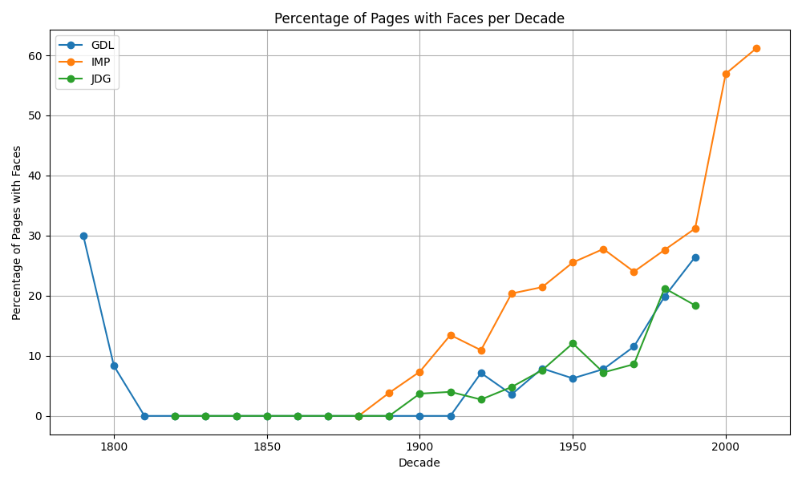

# Assignment 4 - Detecting faces in historical newspapers
The aim of this assignment is to explore the occurrence of *human facial images* in historical newspapers by employing FaceNet with Torch. This inquiry seeks to address the following research question: how has the frequency of human facial depictions evolved in printed media over the past approximately two centuries? Are there discernible disparities, and if so, what implications might they carry?

## Data Source
The assignment works with a corpus of historic Swiss newspapers: the *Journal de Genève* (JDG, 1826-1994); the *Gazette de Lausanne* (GDL, 1804-1991); and the Impartial (IMP, 1881-2017). You can read more about this corpus in the associated [research article](https://zenodo.org/records/3706863)

## Requirements
- Python > 3.10.12
- `gensim` library
- `numpy` library
- `pandas` library
- `codecarbon` library

## Usage
To use this script, follow these steps:

1. Clone or download the repository and make sure you have the file structure as pointed out, and the needed files stored in `in`

2. Set up a virtual environment and install the required packages by running:
    ```
    bash setup.sh
    ```

3. Run the script by executing:
    ```
    bash run.sh
    ```

## Script Overview
- **Face Detection**: The script uses a pretrained MTCNN (Multi-Task Cascaded Convolutional Networks) model for face detection in historical newspaper images.
- **Data Processing**: Images are processed to extract information about the number of faces present in each image and categorize them by decade.
- **Data Analysis**: The script calculates the percentage of pages with faces per decade for each newspaper and generates corresponding CSV files.
- **Visualization**: It also plots the percentage of pages with faces per decade for each newspaper and saves the plot as an image.

## Output Summary
The output of the script includes:

- CSV files containing the count of faces per file as well as an assigned decade
- A plot showing the percentage of pages with faces per decade for each newspaper.

### Figure 1: Plot of the percentage of pages with faces per decade for each newspaper


## Discussion of Limitations and Possible Steps to Improvement
The accuracy of face detection for historical newspaper images heavily relies on the performance of the pretrained face detection model (MTCNN). Any inaccuracies or biases in the model can directly affect the results of the analysis.

Possible biases in the face detection model could include:
- Ethnicity bias: the model may have been trained primarily on datasets containing mainly white faces, leading to bias in terms of detecthing other ethnicities.
- Gender bias: it might be more accurate in detecting face for one gender than the other
- Age bias: similar to above, depending again on what has been included in the training data

Another possible limitation of this setup, might be that the might not be good at detecting faces if the image quality or lightning is poor, therefor potentially skewing the results.

Moreover, a limitations lies within the lack of validation, due to the large volume of historical newspaper images, manually verifying the accuracy of face detections in each image is impractical. Without this, there is no defeinite way to confirm whether the detected faces are correctly identified, potentially leading to false positives or negatives. 

However, it is assumed that the model should perform rather good as it has been benchmarked and used by other researchers.

The findings of an increased percentage of pages with faces over decaded is concluded by the rather significant increase (no significiance testing was however done, but mere eye balling on the plot). The reasons for this increase could be mainly due to technological advancements within print and photography. Moreover it might have also been due to a shift towards visual content in media. 

## File Structure
The project directory should be structured as follows:

```
.
A4/
│
├── in/
│   └── newspapers/
│        ├── GDL/
│        │   ├── <filename>.jpg
│        │   └── ...
│        ├── IMP/
│        │   ├── <filename>.jpg
│        │   └── ...
│        ├── JDG/
│        │   ├── <filename>.jpg
│        │   └── ...
│        └── README-images.txt
├── out/
│   ├── GDL_data.csv
│   ├── IMP_data.csv
│   ├── JDG_data.csv
│   └── newspaper_sample_face_counts.csv
├── src/
│   └── newspaper_face_detection.py
│
├── README.md
├── requirements.txt
├── run.sh
└── setup.sh
```